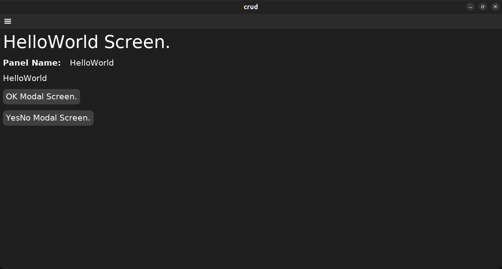

1. At github.com, I created an empty "crud" repo.
2. Then on my laptop I
   1. cloned it,
   1. cd'd into the cloned crud/ folder,
   1. created the framework,
   1. cloned dvui into the crud/src/vendor/ folder,
   1. built it using zig version 11,
   1. ran it.

```shell
＄ git clone https://github.com/JosephABudd/crud.git
＄ cd crud
＄ kickzig framework
＄ git clone https://github.com/david-vanderson/dvui.git src/vendor/dvui/
＄ zig11 build -freference-trace=255
＄ ./zig-out/bin/standalone-sdl
```



## Next

[[More Vendored Packages.|More-Vendored-Packages]]
