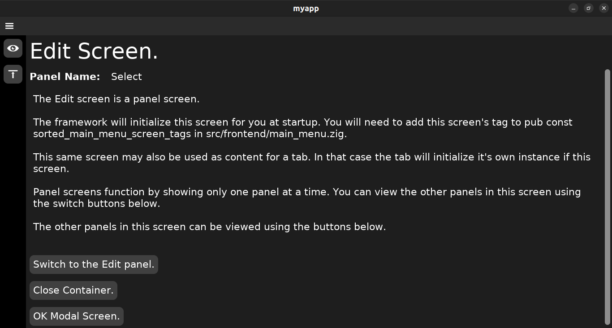

# kickzig "zig and dvui my way"

## Oct 2, 2024: version 0.4.1

Fixed: Tab screen no longer uses message in a framework built without messages.

1. Works with [dvui](https://github.com/david-vanderson/dvui) archive afc277df749f9794d4cce17e257cf1d5b7e9c4f7.
1. Works with zig 0.13.0.

### Updates

* The command `kickzig framework` builds the framework with out messages, message channels and message handlers.
* The command `kickzig framework add-messages` builds the framework with messages, message channels and message handlers built into the framework.
* Added more specific error detection and error messages. Help commands will work anywhere. Screen add/remove commands only work in the root folder or one of it's sub folders. Message add/remove commands only work in the root folder or one of it's sub folders. Message commands also only work if the framework was created with messages added.

### Kickzig does everything I want so at this point I continue

* looking for any legacy code patterns to replace with the zig code patterns that I now favor.
* reviewing inline documentation.
* reviewing messages outout to the user.
* keep up with changes to dvui and zig.

### The example CRUD application and the kickzig wiki

* The kickzig framework is displayed in the [crud](https://github.com/JosephABudd/crud) which is built using 2 differenct layouts.
* The [kickzig.wiki](https://github.com/JosephABudd/kickzig/wiki) documents building that same CRUD.

## Summary

### kickzig is a CLI. It does 3 things

1. **Generates the source code**, of an application framework, written in zig.
   * The framework uses the visually appealing and well documented [dvui](https://github.com/david-vanderson/dvui) graphics framework at the front-end. That said, kickzig also requires the developer to understand how to use the dvui widgets.
   * The source code can be generated with or without it's own message framework which allows the front-end and back-end to communicate asymetrically through channels.
1. **Adds and removes screens** in the source code.
   * Screens are the framework's front-end packages. Each type of screen is unique in how it lays out panels.
   * Each panel is unique in how it displays visual output to the user and receive input from the user.
   * If messages were added into the framework then a screen has a message handler that handles communications between the screen and the back-end's message handlers.
1. **Adds and removes messages** in the source code. If the framework was created with messages, then kickzig can be used to add and remove messages in the framework.
      * Messages are how the framework's front-end and back-end communicate.
      * Messages are sent and received through channels.
      * Each message has it's own back-end handler which receives and/or returns the message.

## Create a framework

kickzig creates a framework that is ready to build and run as soon as you create it. There are 2 options for creating a framework.

1. Build a framework without messages, message channels and message handlers.
   * The command `kickzig framework` generates the source code for a framework that is ready to build and run.
1. Build a framework with messages, message channels and message handlers.
   * The command `kickzig framework add-messages` generates the source code for a framework that is ready to build and run. The framework's front-end screens will have messengers to handle messages and channels for sending and receiving messages. The framework's back-end will have messengers to handle messages and channels for sending and receiving messages.

Nota Bene: Currently, the kickzig generated framework must be built using zig version 0.13.0.

```shell
＄ mkdir myapp
＄ cd myapp
＄ kickzig framework add-messages
＄ zig fetch https://github.com/david-vanderson/dvui/archive/afc277df749f9794d4cce17e257cf1d5b7e9c4f7.tar.gz --save
＄ zig build -freference-trace=255
＄ ./zig-out/bin/myapp
```

### The opening. Hello World screen


### The OK modal screen popped from the opening Hello world screen


### The YesNo modal screen popped from the opening Hello world screen


## Add and remove screens in the front-end

The framework's front-end is a collection of screens. A screen is a layout of panels. When a screen is added to the framework it functions perfectly.

### Panel screens

1. A Panel screen always functions when it is added to the framework.
1. A Panel screen only lays out and displays one of it's panels at any one time.

### Examples

`kickzig screen add-panel Edit Select Edit` creates a panel screen named **Edit** in the panel/ folder. The default panel is named **Select** and another panel is named **Edit**. By default the Select and Edit panels each display their screen and panel name. It's the developers job to edit any panel's file to achieve the propper functionality.

`kickzig screen add-panel Remove Select Confirm` creates a panel screen named **Remove** in the panel/ folder. The default panel is named **Select** and another panel named **Confirm**. By default the Select and Confirm panels each display their screen and panel name. Again, it's the developers job to edit any panel's file to achieve the propper functionality.

### tab-bar screens

1. A tab-bar screen always functions when the developer creates it.
1. Contains one example tab for each tab-type that the developer named. However, the developer may have 0 or more tabs of each tab-type in the tab-bar. For example, lets say, my tab-bar has a Log tab-type which will display a log from an IRC Chat room. I can open a Log tab-type whenever the user joins a chat room. A tab can also close when the user leaves the tab's chat room. A tab-bar screen with no visible tabs will not display by default.
1. Defaults to:
   * A .horizontal bar direction that the user can toggle between .horizontal and .vertical.
   * User closable tabs.
   * User movable tabs.
   * A visible vertical tab-bar that the user can toggle between visible and not visible.

A horizontal tab-bar layout lays the horizontal tab-bar above where the selected tab's content is displayed.

A vertical tab-bar layout lays the vertical tab-bar left of where the selected tab's content is displayed.

A tab's content can be any other screen of a panel in the same screen package.

#### Example

`kickzig screen add-tab Contacts Add *Edit *Remove` creates a tab screen named **Contacts** with 3 tab types ( Add, Edit, Remove ) and 1 instance of each tab running in the tab-bar as an example.

* The **Add** tab type gets it's content from the Add panel in the screen package.
* I prefixed the **Edit** tab name with **\*** so that it will use the **Edit** screen in the panel/ folder, for content.
* I prefixed the **Remove** tab name with **\*** so that it will use the **Remove** screen in the panel/ folder, for content.

Below is the Contacts screen with the horizontal layout. Notice that the **Remove** tab is selected and is displaying the **Remove** content-screen.


Below is the Contacts screen with the vertical layout. Notice that the **Edit** tab is selected and is displaying the **Edit** panel-screen.


Below is the Contacts screen with the vertical layout. Notice that the tab-bar is closed even though the **Edit** tab is selected and is displaying the **Edit** panel-screen.



### Modal screens

Modal screens are the framework's dialogs. They are the same as panel screens where one panel is displayed at a time.

When a modal screen is to be displayed, the framwork caches the current screen before displaying the modal screen. When a modal screen is finally closed, the framework gets that cached previous screen and displays it.

The **OK** modal screen and **YesNo** modal screen are part of the framework. They also work as examples for writing other types of dialogs although they do not have a messenger. The **YesNo** modal screen is interesting because it demostrates how to use call backs.

The **EOJ** modal screen is also part of the framework. It is only used in the shutdown process.

`kickzig screen add-modal YesNoMaybe YesNoMaybe` creates a modal screen named **YesNoMaybe** with a panel named **YesNoMaybe**. It also creates a **YesNoMaybe** modal parameter for passing information to the screen's setState function.

#### Removing an unwanted screen

`kickzig screen remove YesNoMaybe` removes the screen named **YesNoMaybe**.

### DVUI tools for the developer

1. **The DVUI Debug window.** The framework's main menu allows the developer to open and use the DVUI debug window.
1. **The DVUI Demo window.** The framework's main menu also allows the developer to turn on the DVUI demo window. The actual example code is **pub fn demo() !void** in [Examples.zig](https://github.com/david-vanderson/dvui/blob/main/src/Examples.zig).
1. The developer can turn the above menu items off by setting `pub const show_developer_menu_items: bool = false;` in **src/frontent/api.zig**.
1. **The DVUI source code.** The src code is cloned in **src/vendor/dvui/** so that it is immediately available for review.


## kickzig for messages

The front-end and back-end communicate asynchronously using messages. Messages are sent and messages are received. There is no waiting for a message.

### Adding a message

* The command `kickzig message add-bf «message_name»` will add a 1 way message which travels back-to-front.
* The command `kickzig message add-fbf «message_name»` will add a 2 way message which travels front-to-back and back-to-front.
* The command `kickzig message add-bf-fbf «message_name»` will add a message that is both 1 way and 2 way. That is to say that the back-end messenger has 2 different functions for sending a message.
  1. The **fn receiveJob** receives a message and then sends the response.
  1. The **fn triggerJob** only sends a message.

### Removing a message

`kickzig message remove AddContact` will remove the **AddContact** message from the framework.

### Listing all messages

`kickzig message list` will display each message.

## Startup parameters

Front-end startup parameters are the only parameter passed to the front-end packages at startup. Back-end startup parameters are the only parameter passed to the back-end packages at startup.

The developer can add to the startup parameters.

1. The startup parameter `close_down_jobs: *_closedownjobs_.Jobs` allows modules to add their shut down call back to be executed during the closing down process.
1. The startup parameter `exit: ExitFn` is the function called only when there is a fatal error. It starts the shut down process with an error message.

## Closing down the application


### 2 Ways to start the shut down process

1. **The user clicks the window's ❎ button**. The `main_loop:` in **src/main.zig** calls the closer module's `fn close(user_message: []const u8) void` which starts the closing process.
1. **A fatal error occurs in the developer's code**. That module calls the startup parameter `exit` which starts the closing process. Example below.

```zig
        self.receiveJob(message) catch |err| {
            // Fatal error.
            self.exit(@src(), err, "self.receiveJob(message)");
            return err;
        };
```
