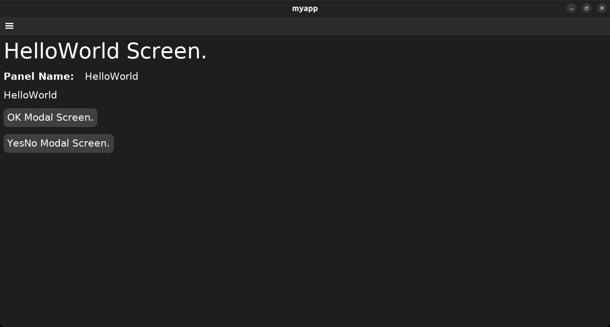
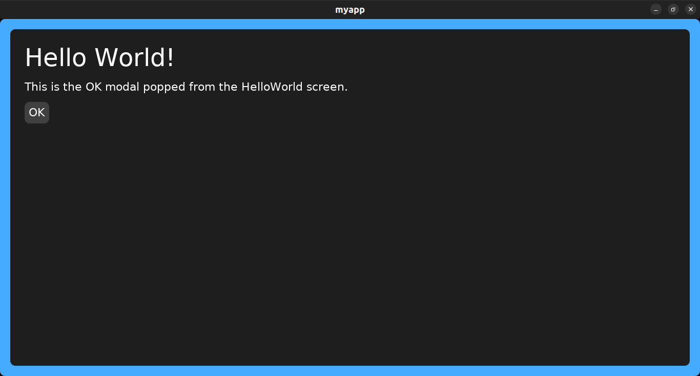
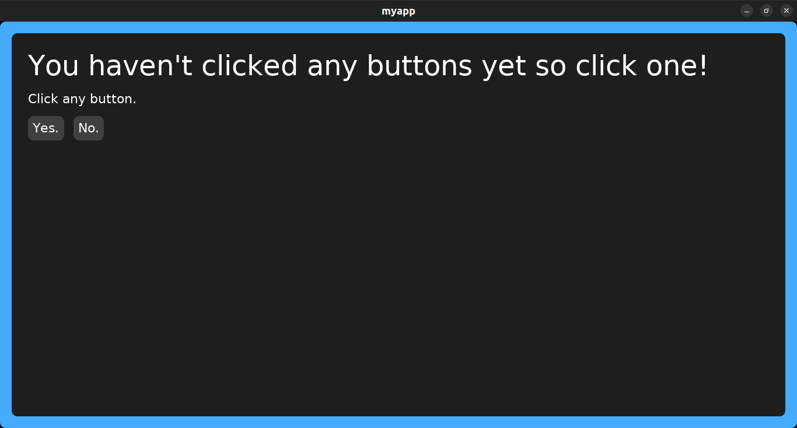
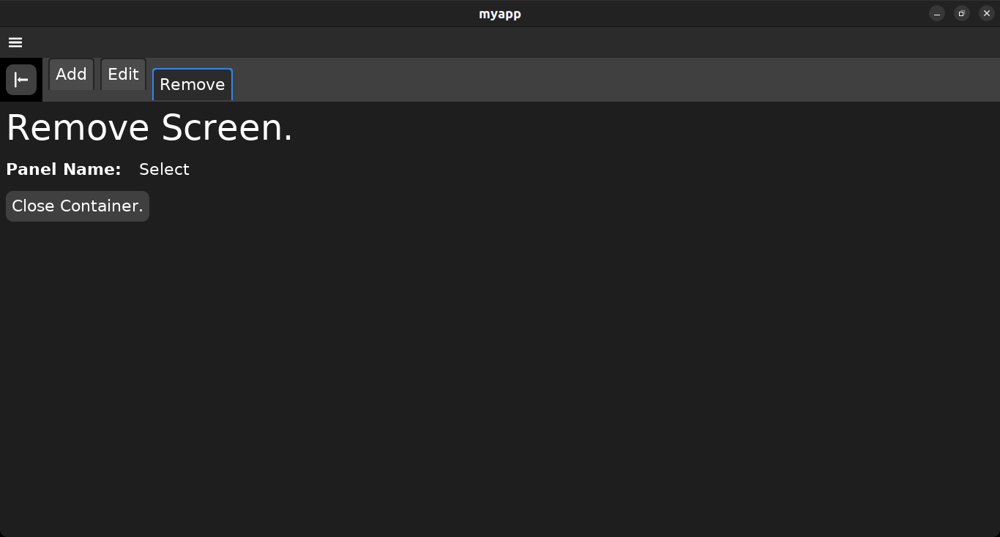
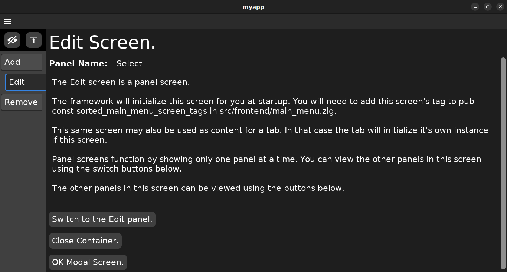
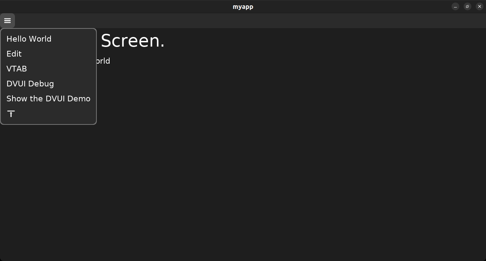
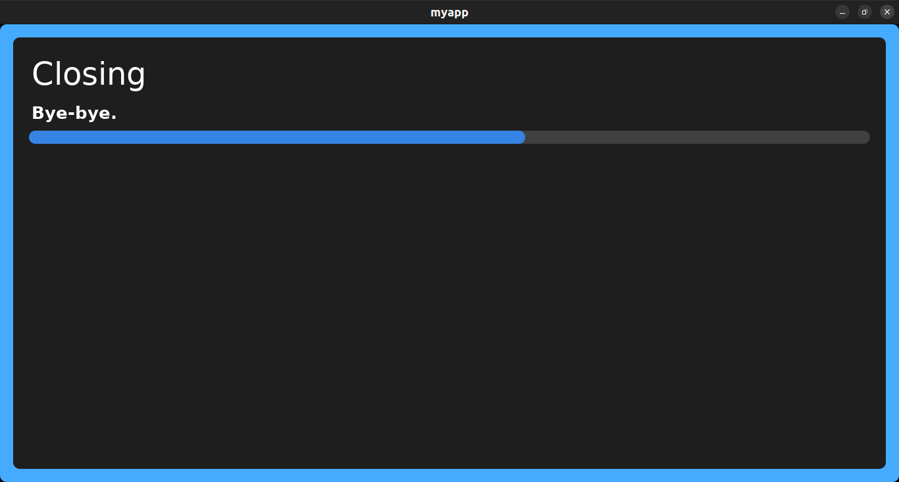

# kickzig "zig and dvui my way"

Still a work in progress.

## June 6, 2024: version 0.1.1

Added bugfix to messages.

## Summary

1. kickzig is a cli that generates an application framework which uses the beautiful dvui graphics framework. The command `kickzig framework` generates that framework that is ready to build and run immediatley.
1. kickzig allows the developer to add and remove
   1. Screens. Screens are front-end packages. Screens implement GUI logic.
   1. Messages.
      * Each message has a channel for sending and a channel for receiveing.
      * Each front-end screen has a messenger that can send and receive any or all messages with the back-end.
      * The back-end has 1 messenger for each message. Each messenger can receive and send it's assigned message.

The [wiki](https://github.com/JosephABudd/kickzig/wiki) documents building a CRUD with an previous version of kickzig. It will be updated using the current version of kickzig as time allows.

## Example: Creating a framework, building and running an application

The command `kickzig framework` generates the source code for a framework that is ready to run. The framework requires a vendored clone of David Vanderson's DVUI package.

Nota Bene: Currently, dvui must be built using zig version 0.12.0.

```shell
＄ mkdir myapp
＄ cd myapp
＄ kickzig framework
＄ zig fetch https://github.com/david-vanderson/dvui/archive/27b59c5f25350ad4481110eecd0920b828e61a30.tar.gz
＄ zig build -freference-trace=255
＄ ./zig-out/bin/myapp
```

### The opening. Hello World screen



### The OK modal screen popped from the opening Hello world screen



### The YesNo modal screen popped from the opening Hello world screen



## kickzig for the front-end

kickzig is mostly a tool for the application's front-end. The framework's front-end is a collection of screens. Each screen is a collection of panels. Panel's are displayed one at a time.

A screen is a collection of panels and has it's own messenger which communicates with the back-end.

Whenever you add any type of screen with kickzig, it functions perfectly.

### Panel screens

A Panel screen is the simplest type of screen. It only displays one of it's panels at any one time. Panel screens always function when you create them although the panels display the screen name and panel name by default.

The Panel screens are useful for creating other types of screens. They are the first screens that I created. I used the Panel screens to create each of the other types of screens.

### Content screens

A Content screen is really just another Panel screen. That's why it's in the panel/ folder with the other panel-screens. The difference is that a content screen is only going to be used for a tab's content.

### The differences between panel screens and content screens

1. **Implementation**
   * A **content screen** implementation:
     1. is initialized by the tab that uses the screen for content.
   * A **panel screen** implementation:
     1. is initialized by the app at startup and should there fore, be added to the main menu or linked to some other way.
     1. can also be initialized by a tab that is using the screen for content.
1. **Framing**
   * A **content screen** frames:
     1. in a tab's content area.
   * A **panel screen** frames:
     1. in the app's main view.
     1. in a tab's content area.

### Examples

`kickzig screen add-panel Edit Select Edit` creates a panel screen named **Edit** in the panel/ folder. The default panel is named **Select** and another panel is named **Edit**. By default the Select and Edit panels each display their screen and panel name.

`kickzig screen add-content Remove Select Confirm` creates a content screen named **Remove** in the panel/ folder. The default panel is named **Select** and another panel named **Confirm**. By default the Select and Confirm panels each display their screen and panel name.

### tab-bar screens

1. A tab-bar screen always functions when you create it.
1. Contains one example tab for each tab that you named.
1. Defaults to:
   * A .horizontal bar direction that the user can toggle between .horizontal and .vertical.
   * User closable tabs.
   * User movable tabs.

Horizontal tab-bar screens have a horizontal tab-bar above where the selected tab's content is displayed.

Vertical tab-bar screens have a vertical tab-bar left of where the selected tab's content is displayed.

A tab's content can be one of the screen's own panels or a tab's content can be any screen in the panel/ folder.

#### Example

`kickzig screen add-tab Contacts Add *Edit *Remove` creates a tab screen named **Contacts** with 3 tab types ( Add, Edit, Remove ) and 1 instance of each tab running in the tab-bar as an example.

* The **Add** tab type gets it's content from the Add panel in the screen package.
* I prefixed the **Edit** tab name with **\*** because it uses, the **Edit** screen in the panel/ folder, for content.
* I prefixed the **Remove** tab name with **\*** because it uses, the **Remove** screen in the panel/ folder, for content.

Below is the Contacts screen with the horizontal layout. Notice that the **Remove** tab is selected and is displaying the **Remove** content-screen.



Below is the Contacts screen with the vertical layout. Notice that the **Edit** tab is selected and is displaying the **Edit** panel-screen.



### Modal screens

Modal screens are the framework's dialogs. They are the same as panel screens where one panel is displayed at a time.

When a modal screen is to be displayed, the framwork caches the current screen before displaying the modal screen. When a modal screen is finally closed, the framework gets that cached previous screen and displays it.

The **OK** modal screen and **YesNo** modal screen are part of the framework. They also work as examples for writing other types of dialogs although they do not have a messenger. The **YesNo** modal screen is interesting because it demostrates how to use call backs.

The **EOJ** modal screen is also part of the framework. It is only used in the shutdown process.

`kickzig screen add-modal YesNoMaybe YesNoMaybe` creates a modal screen named **YesNoMaybe** with a panel named **YesNoMaybe**. It also creates a **YesNoMaybe** modal parameter for passing information to the screen's setState function.

#### Removing an unwanted screen

`kickzig screen remove YesNoMaybe` removes the screen named **YesNoMaybe**.

### DVUI tools for the developer

1. **The DVUI Debug window.** The framework's main menu allows the developer to open and use the DVUI debug window.
1. **The DVUI Demo window.** The framework's main menu also allows the developer to turn on the DVUI demo window. The actual example code is **pub fn demo() !void** in **src/vendor/dvui/src/Examples.zig**.
1. The developer can turn the above menu items off by setting `pub const show_developer_menu_items: bool = false;` in **src/frontent/api.zig**.
1. **The DVUI source code.** The src code is cloned in **src/vendor/dvui/** so that it is immediately available for review.



## kickzig for messages

The front-end and back-end communicate asynchronously using messages. Messages are sent and messages are received. There is no waiting.

### Adding a message

* The command `kickzig message add-bf «message_name»` will add a 1 way message which the back-end «message_name» messenger sends to the front-end when triggered from anywhere in the back-end.
* The command `kickzig message add-fbf «message_name»` will add a 2 way message, that begins with any front-end screen's messenger sending the message and expecting a response from the back-end «message_name» messenger.
* The command `kickzig message add-bf-fbf «message_name»` will add a message that is both 1 way and 2 way:

When you add a message you also add with it:

1. The message struct in deps/message/«message_name».zig.
1. The back-end messenger at backend/messenger/«message_name».zig.
1. The message channels in:
   * startup.receive_channels,
   * startup.send_channels,
   * startup.triggers.

### Removing a message

`kickzig message remove AddContact` will remove

1. The message at **src/deps/message/AddContact.zig**.
1. The back-end messenger at **src/backend/messenger/AddContact.zig**.
1. The message channels at **src/deps/channel/\*\*/AddContact.zig**.
1. References to the channels in the startup params at **src/deps/startup/api.zig**.

### Listing all messages

`kickzig message list` will display each message.

## Startup parameters

Front-end startup parameters are the only parameter passed to the front-end packages at startup. Back-end startup parameters are the only parameter passed to the back-end packages at startup.

The developer can add to the startup parameters.

1. The startup parameter `close_down_jobs: *_closedownjobs_.Jobs` allows modules to add their shut down call back to be executed during the closing down process.
1. The startup parameter `exit: ExitFn` is the function called only when there is a fatal error. It starts the shut down process with an error message.

## Closing down the application



### 2 Ways to start the shut down process

1. **The user clicks the window's ❎ button**. The `main_loop:` in **standalone-sdl.zig** calls the closer module's `fn close(user_message: []const u8) void` which starts the closing process.
1. **A fatal error occurs in the developer's code**. That module calls the startup parameter `exit` which starts the closing process. Example below.

```zig
        self.receiveJob(message) catch |err| {
            // Fatal error.
            self.exit(@src(), err, "self.receiveJob(message)");
            return err;
        };
```
