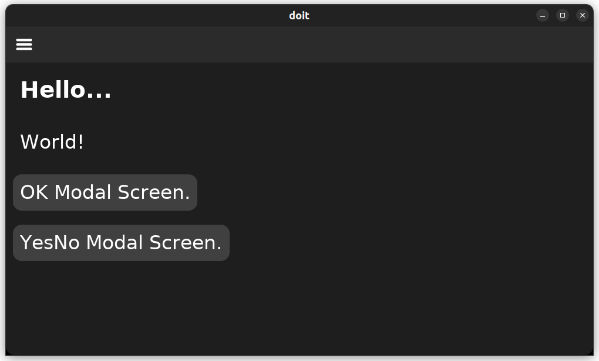
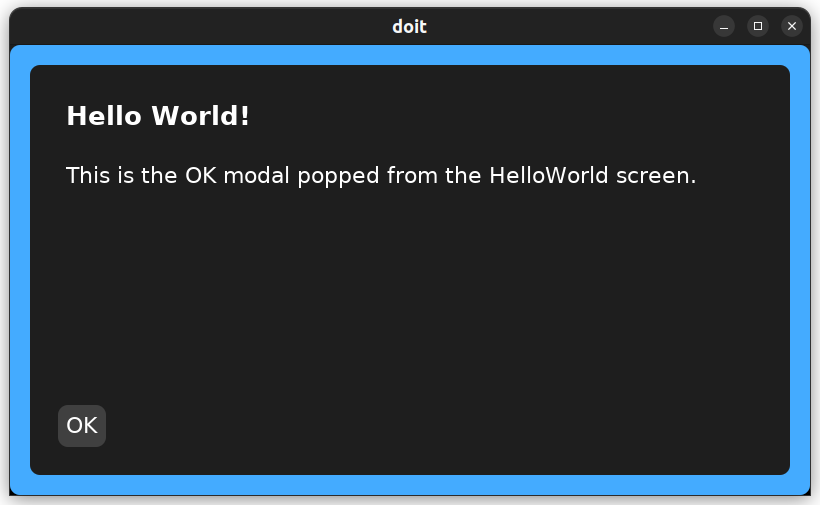
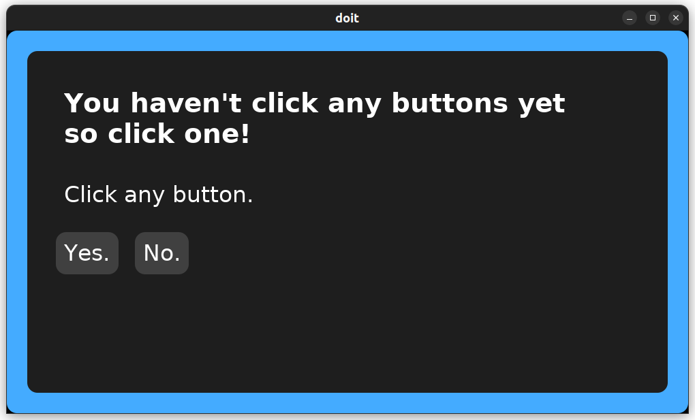
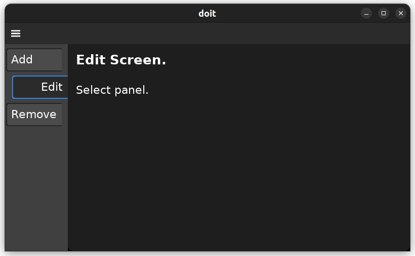
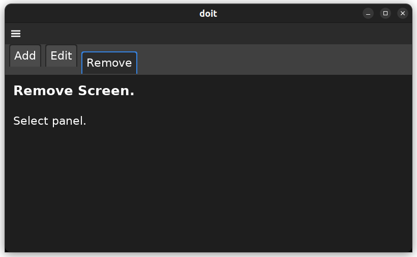
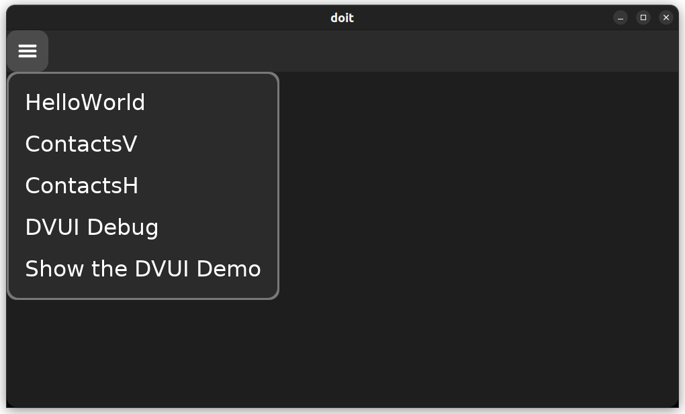

# kickzig "zig and dvui my way"

## Project summary

_Whenever I begin working with a new language I like to rewrite certain programs with that new language. So here I am rewriting my kick program which was previously written in GO._

As I started learning zig, I found and started using [Dave Vanderson's dvui project](https://github.com/david-vanderson/dvui). Dvui is a very nice graphics framework that is young, easy to use and just keeps getting better.

As I continue to learn and appreciate zig and dvui, I am recreating my kick code generator to work with zig and dvui.

## Dec 20, 2023

1. Message management has been added.
1. Kickzig does everything I want it to.

### To do

I'm going to build a CRUD and

* do a step by step in the WIKI,
* add clearer CLI responses and followup instructions,
* add the missing source code documentation,
* fix the bad source code documentation.

### kickzig is a code generator

Kickzig generates my version of an application framework, written in zig, using dvui, that is ready to build and run right away. The application has a front-end which is the gui logic and it has the back-end which is the business logic. The front-end and back-end are separate threads which asynchronously communicate using messages. Kickzig also adds and removes those messages.

1. The framework puts the application code at
   * «app-folder»/ (build.zig, build.zig.zon, standalone.zig, etc)
   * «app-folder»/src/@This/back-end/ (back-end code)
   * «app-folder»/src/@This/front-end/ (front-end code)
   * «app-folder»/src/@This/deps/ (dependencies)
1. Vendor code can be placed in «app-folder»/src/vendor/.
1. DVUI must be cloned into «app-folder»/src/vendor/dvui/.

### Example: Creating a framework, building and running an application

The command `kickzig framework` generates the source code for a framework that is ready to run. The framework requires a vendored clone of David Vanderson's DVUI package.

```shell
＄ mkdir myapp
＄ cd myapp
＄ kickzig framework
＄ git clone https://github.com/david-vanderson/dvui.git src/vendor/dvui/
＄ zig build -freference-trace=255
＄ ./zig-out/bin/standalone-sdl
```

#### The opening. Hello World



#### The OK modal screen



#### The YesNo modal screen



### kickzig for the front-end

kickzig is mostly a tool for the application's front-end. The framework's front-end is a collection of screens. Each screen is a collection of panels. Panel's are displayed one at a time.

#### Screens

A screen is a collection of panels. Panels are displayed one at a time. A screen also has it's own messenger which communicates with the back-end.

Whenever you add any type of screen with kickzig, it functions perfectly.

1. A screen can be accessed from the main menu if you add it's name to the main menu list.
1. A screen can be content for a tab in a vertical tabbar screen. (See **Vertical tab-bar screens** below.)
1. A screen can be content for a tab in a horizontal tabbar screen. (See **Horizontal tab-bar screens** below.)

##### Panel screens

A Panel screen is the simplest type of screen. It only displays one of it's panels at any one time. Panel screens always function when you create them although the panels display the screen name and panel name by default.

`kickzig screen add-panel Edit Select Edit` creates a panel screen named **Edit** with a default panel named **Select** and another panel named **Edit**. By default the Select and Edit panels each display their screen and panel name.

`kickzig screen add-panel Remove Select Confirm` creates a panel screen named **Remove** with a default panel named **Select** and another panel named **Confirm**. By default the Select and Confirm panels each display their screen and panel name.

##### Vertical tab-bar screens

Vertical tab-bar screens have a vertical tab-bar left of where the selected tab's content is displayed. A tab's content can be one of the screen's own panels or a tab's content can be another screen.

Vertical tab-bar screens always function when you create them as long as each tab which uses an external screen is using an already existing screen. If a screen does not exist for any tab, then you need to create it before the vertical tab-bar screen will function.

`kickzig screen add-vtab ContactsV +Add Edit Remove` creates a vertical tab screen named **ContactsV** with 3 tabs. The **Add** tab has it's own panel in the screen package because I prefixed the name **Add** with **+**. The **Edit** tab uses the **Edit** screen which I created before creating this screen. The **Remove** tab uses the **Remove** screen which I created before creating this screen.

Below is the ContactsV screen with the **Edit** tab selected. Notice that the **Edit** tab is displaying the **Edit** panel-screen.



##### Horizontal tab-bar screens

Horizontal tab-bar screens have a horizontal tab-bar above where the selected tab's content is displayed. A tab's content can be one of the screen's own panels or a tab's content can be another screen.

Horizontal tab-bar screens always function when you create them as long as each tab which uses an external screen is using an already existing screen. If a screen does not exist for any tab, then you need to create it before the horizontal tab-bar screen will function.

`kickzig screen add-htab ContactsH +Add Edit Remove` creates a horizontal tab screen named **Contacts** with 3 tabs. The **Add** tab has it's own panel in the screen package because I prefixed the name **Add** with **+**. The **Edit** tab uses the **Edit** screen which I created before creating this screen. The **Remove** tab uses the **Remove** screen which I created before creating this screen.

Below is the ContactsH screen with the **Remove** tab selected. Notice that the **Remove** tab is displaying the **Remove** panel-screen.



##### Modal screens

Modal screens are the framework's dialogs. They are the same as panel screens where one panel is displayed at a time.

When a modal screen is to be displayed, the framwork pushes the current screen onto a screen stack before displaying the modal screen. When a modal screen is finally closed, the framework pulls that previous screen off the stack and displays it.

An **OK** modal screen and a **YesNo** modal screen are provided as examples for writing other types of dialogs. The **YesNo** modal screen is interesting because it demostrates how to use call backs.

`kickzig screen add-modal YesNoMaybe YesNoMaybe` creates a modal screen named **YesNoMaybe** with a panel named **YesNoMaybe**. It also creates a **YesNoMaybe** modal parameter for passing information to the screen's goModalFn().

##### Removing an unwanted screen

`kickzig screen remove YesNo` removes the screen named **YesNO**.

#### Screen panels

I haven't added the commands for adding panels to and removing panels from screens.

### DVUI tools for the developer

1. **The DVUI Debug window.** The framework's main menu allows the developer to open and use the DVUI debug window.
1. **The DVUI Demo window.** The framework's main menu also allows the developer to turn on the DVUI demo window. The actual example code is **pub fn demo() !void** in **src/vendor/dvui/src/Examples.zig**.
1. The developer can turn the above menu items off by setting `pub const show_developer_menu_items: bool = false;` in **src/@This/frontent/api.zig**.
1. **The DVUI source code.** The src code is cloned in **src/vendor/dvui/** so that it is immediately available for review.



### kickzig for messages

The front-end and back-end are separate threads that communicate using messages. Messages are sent and messages are received. There is no waiting for a message response. Responses happend when they happen.

I haven't added the commands for adding and removing messages but they are shown below.

#### Adding a message

Adding a message also adds the back-end's message handler at src/@This/backend/messenger/.

`kickzig message add AddContact` will add the **AddContact** message to the framework and the **AddContact** message handler at **src/@This/backend/messenger/AddContact.zig**. The message handler functions but has no functionality till you give it some.

#### Removing a message

Removing a message also removes the back-end's message handler at src/@This/backend/messenger/.

`kickzig message remove AddContact` will remove the **AddContact** message from the framework and the **AddContact** message handler at **src/@This/backend/messenger/AddContact.zig**.

#### Listing all messages

`kickzig message list` will display each message.
