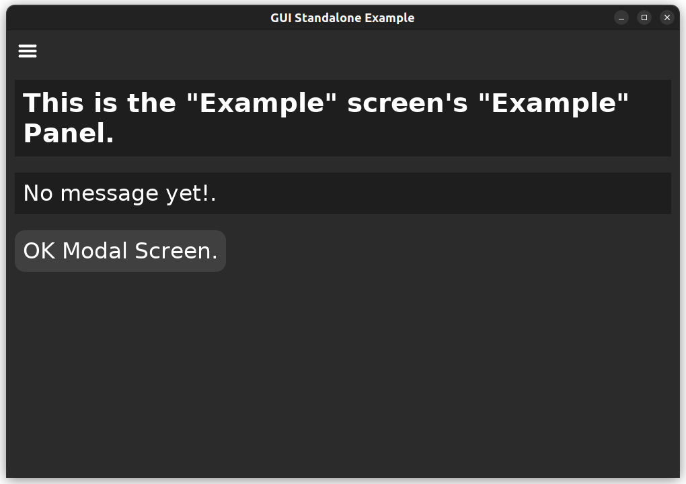

# kickzig "zig and dvui my way"

## Example

```shell
＄ mkdir myapp
＄ cd myapp
＄ kickzig framework
＄ git clone https://github.com/david-vanderson/dvui.git src/vendor/dvui/
＄ zig build -freference-trace=255
＄ ./zig-out/bin/standalone-sdl
```




## Oct 12, 2023

### A running framework

1. The command `kickzig framework` creates a running framework. It has an **Example** screen as the opening screen which has a button to open the **OK** modal screen. So one can see how modals are used.
1. Added modal screens. The **OK** modal screen is provided by default. Any other modal screens can be easily created for any reason.
1. The framework now puts the application code at
   * «app-folder»/src/@This/backend/
   * «app-folder»/src/@This/frontend/
   * «app-folder»/src/@This/deps/
1. Vendor code is in «app-folder»/src/vendor/. The framework's build.zig expects dvui to be cloned into «app-folder»/src/vendor/dvui/.
1. Now that I have the framework closer to how I want it for zig, I still need to Add the tests and documentation for the working code.
1. For templating, I'm now just using using std.mem.replace and std.fmt.print.

## Sep 8, 2023

### Completed so far

1. The command "kickzig" displays the usage. The usage is incomplete and will progress as the application does.
1. The command "kickzig framework" creates the framework's folders. It does not yet create files as I'm still testing and improving my template cli tool and kickzig's template module, based on my limited understanding of [ZTT](https://github.com/MasterQ32/ZTT).

### Next

1. Add the tests and documentation for the working code.
1. Continue developing the template tool and kickzig's template module.
1. Further kickzig's handling of "kickzig framework" so that it writes files to the ./ folder. Then add the tests.

### Followup

Once I have

* a tested way to handle command line user input,
* a tested template module,
* the tests done for my other working modules,

I can add the handlers for the remaining commands.

## Sep 5, 2023

kickzig is a code generator that will create my application framework in zig using the excellent gui [dvui](https://github.com/david-vanderson/dvui).

kickzig will only do 3 things.

1. Creates it's application framework code in a folder with a zig.mod file.
1. Adds to and removes from the framework GUI a little or a lot at a time.
1. Adds and removes messages and message handlers in the framework.

## Project summary

I'm learning zig as I build this tool and my okp app.

This is version 0.0.0. I'm slowly figuring out how to rewrite this in zig. Some of the kickfyne's GO source code in included for me to reference.
