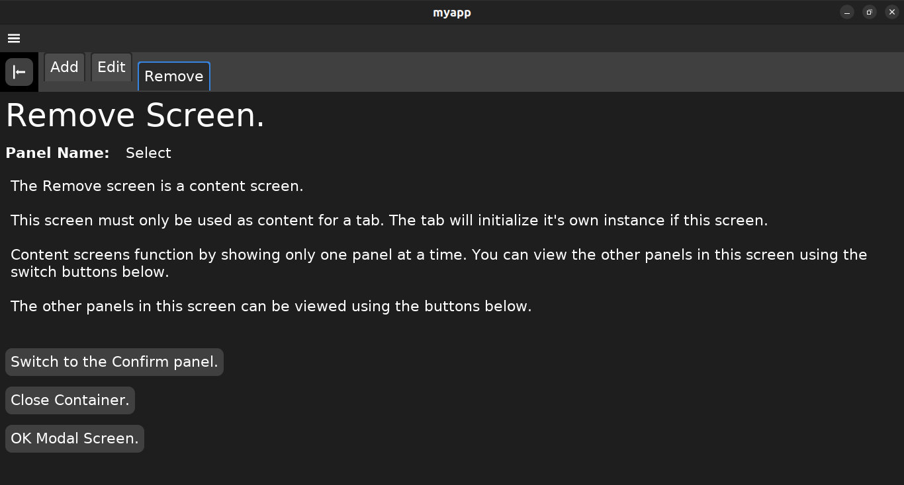
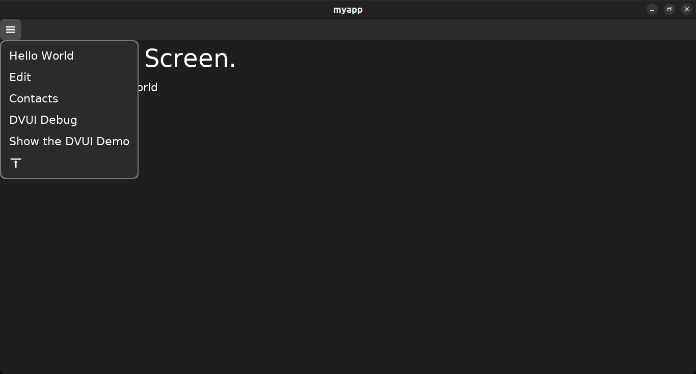

# kickzig "zig and dvui my way"

Still, very much a work in progress.

## June 20, 2024: version 0.2.0

Works with [dvui](https://github.com/david-vanderson/dvui) and zig v. 0.13.0.

## Summary

### kickzig is a CLI. It does 3 things

1. **Generates the source code**, of an application framework, written in zig. The framework which uses the beautiful [dvui](https://github.com/david-vanderson/dvui) graphics framework in the front-end. That said, kickzig also requires the developer to understand how to use the dvui widgets. The framework source code contains various widget examples. (That's why it runs right out of the box.) You will find some in the framework source code. Also see the dvui [Examples.zig](https://github.com/david-vanderson/dvui/blob/main/src/Examples.zig) or the [dvui demo](https://github.com/david-vanderson/dvui-demo).
1. **Adds and removes screens** in the source code.
   * Screens are the framework's front-end packages that display content to the user and receive input from the user.
   * Different types of screens do that in their own unique way.
   * A screen may have one or more panels. Panels are where the developer designs a display and receives input from the user.
   * A screen has a messenger which communicates with the back-end. The developer subscribes the messenger to the channels of messages that need to be received. The developer adds functions to send and receive messages.
1. **Adds and removes messages** in the source code.
      * Messages are how the framework's front-end and back-end communicate.
      * The developer will customize each message.
        * A message's front-end payload is what the front-end sends to the back-end. The developer will want to customize the front-end payload.
        * A message's back-end payload is what the back-end sends to the front-end. By default, the back-end payload only returns an optional error message for the user. The developer is free to cutomize the back-end payload.
      * Each front-end screen has a messenger that can send and receive any or all messages with the back-end.
        * The developer will subscribe a screen messenger to a message's receive channel in order to receive that message.
        * The developer will send a message through it's send channel.
        * The developer will create the messenger's send and receive functions.
      * The back-end has 1 messenger for each message.
        * A back-end messenger by default
          * is already subscribed to it's message's receive channel.
          * is already receiving it's messages through that receive channel.
          * is already returning it's message through it's send channel.
          * is already handling errors.
        * So what does the developer have to do?
          * For back-end messengers which receive a message, the developer must provide the required functionality for processing the message in the messenger's fn **receiveJob**.
          * For back-end messengers which can be triggered, the developer must provide the required functionality for creating a new message in the messenger's fn **triggerJob**.
        * Those messengers which receive a message can also trigger other back-end messengers to send their message. For example, an **AddContact** messenger can trigger a **RebuildContactList** messenger to send the updated list of contacts to the front end.

The [wiki](https://github.com/JosephABudd/kickzig/wiki) documents building a CRUD with an previous version of kickzig. It will be updated using the current version of kickzig as time allows.

## Example: Creating a framework, building and running an application

The command `kickzig framework` generates the source code for a framework that is ready to run. The framework requires a fetched archive of David Vanderson's DVUI package. (Sounds complicated but its not. See below.)

Nota Bene: Currently, the kickzig generated framework must be built using zig version 0.13.0.

```shell
＄ mkdir myapp
＄ cd myapp
＄ kickzig framework
＄ zig fetch https://github.com/david-vanderson/dvui/archive/8b29569d96fe3f037ec2fc707be53c4e0a0ad2d1.tar.gz --save
＄ zig build -freference-trace=255
＄ ./zig-out/bin/myapp
```

### The opening. Hello World screen


### The OK modal screen popped from the opening Hello world screen


### The YesNo modal screen popped from the opening Hello world screen


## kickzig for the front-end

kickzig is mostly a tool for the application's front-end. The framework's front-end is a collection of screens. Each screen is a collection of panels. Panel's are displayed one at a time.

A screen is a collection of panels and has it's own messenger which communicates with the back-end.

Whenever the developer adds any type of screen with kickzig, it functions perfectly.

### Panel screens

A Panel screen is the simplest type of screen. It only displays one of it's panels at any one time. Panel screens always function when the developer creates them although the panels display the screen name and panel name by default.

The Panel screens are useful for creating other types of screens. They are the first screens that I created. I used the Panel screens to create each of the other types of screens.

### Content screens

A Content screen is really just another Panel screen. That's why it's in the panel/ folder with the other panel-screens. The difference is that a content screen is only going to be used for a tab's content.

### The differences between panel screens and content screens

1. **Implementation**
   * A **content screen** implementation:
     1. is initialized by the tab that uses the screen for content.
   * A **panel screen** implementation:
     1. is initialized by the app at startup and should there fore, be added to the main menu.
     1. can also be initialized by a tab that is using the screen for content.
1. **Framing** is when a screen is drawn and user input is received.
   * A **content screen** frames:
     1. in a tab's content area.
   * A **panel screen** frames:
     1. in the app's main view.
     1. in a tab's content area.

### Examples

`kickzig screen add-panel Edit Select Edit` creates a panel screen named **Edit** in the panel/ folder. The default panel is named **Select** and another panel is named **Edit**. By default the Select and Edit panels each display their screen and panel name. It's the developers job to edit any panel's file to achieve the propper functionality.

`kickzig screen add-content Remove Select Confirm` creates a content screen named **Remove** in the panel/ folder. The default panel is named **Select** and another panel named **Confirm**. By default the Select and Confirm panels each display their screen and panel name. Again, it's the developers job to edit any panel's file to achieve the propper functionality.

### tab-bar screens

1. A tab-bar screen always functions when the developer creates it.
1. Contains one example tab for each tab-type that the developer named. However, the developer may have 0 or more tabs of each tab-type in the tab-bar. For example: My tab-bar has a Log tab-type which will display a log from an IRC Chat room. I can open a Log tab-type for each chat room the user joins. Each tab can also close when the user leaves the chat room.
1. Defaults to:
   * A .horizontal bar direction that the user can toggle between .horizontal and .vertical.
   * User closable tabs.
   * User movable tabs.

Horizontal tab-bar screens have a horizontal tab-bar above where the selected tab's content is displayed.

Vertical tab-bar screens have a vertical tab-bar left of where the selected tab's content is displayed.

A tab's content can be one of the screen's own panels or a tab's content can be any screen in the panel/ folder.

#### Example

`kickzig screen add-tab Contacts Add *Edit *Remove` creates a tab screen named **Contacts** with 3 tab types ( Add, Edit, Remove ) and 1 instance of each tab running in the tab-bar as an example.

* The **Add** tab type gets it's content from the Add panel in the screen package.
* I prefixed the **Edit** tab name with **\*** so that it will use the **Edit** screen in the panel/ folder, for content.
* I prefixed the **Remove** tab name with **\*** so that it will use the **Remove** screen in the panel/ folder, for content.

Below is the Contacts screen with the horizontal layout. Notice that the **Remove** tab is selected and is displaying the **Remove** content-screen.



Below is the Contacts screen with the vertical layout. Notice that the **Edit** tab is selected and is displaying the **Edit** panel-screen.


### Modal screens

Modal screens are the framework's dialogs. They are the same as panel screens where one panel is displayed at a time.

When a modal screen is to be displayed, the framwork caches the current screen before displaying the modal screen. When a modal screen is finally closed, the framework gets that cached previous screen and displays it.

The **OK** modal screen and **YesNo** modal screen are part of the framework. They also work as examples for writing other types of dialogs although they do not have a messenger. The **YesNo** modal screen is interesting because it demostrates how to use call backs.

The **EOJ** modal screen is also part of the framework. It is only used in the shutdown process.

`kickzig screen add-modal YesNoMaybe YesNoMaybe` creates a modal screen named **YesNoMaybe** with a panel named **YesNoMaybe**. It also creates a **YesNoMaybe** modal parameter for passing information to the screen's setState function.

#### Removing an unwanted screen

`kickzig screen remove YesNoMaybe` removes the screen named **YesNoMaybe**.

### DVUI tools for the developer

1. **The DVUI Debug window.** The framework's main menu allows the developer to open and use the DVUI debug window.
1. **The DVUI Demo window.** The framework's main menu also allows the developer to turn on the DVUI demo window. The actual example code is **pub fn demo() !void** in [Examples.zig](https://github.com/david-vanderson/dvui/blob/main/src/Examples.zig).
1. The developer can turn the above menu items off by setting `pub const show_developer_menu_items: bool = false;` in **src/frontent/api.zig**.
1. **The DVUI source code.** The src code is cloned in **src/vendor/dvui/** so that it is immediately available for review.



## kickzig for messages

The front-end and back-end communicate asynchronously using messages. Messages are sent and messages are received. There is no waiting for a message.

### Adding a message

* The command `kickzig message add-bf «message_name»` will add a 1 way message which travels back-to-front.
* The command `kickzig message add-fbf «message_name»` will add a 2 way message which travels front-to-back and back-to-front.
* The command `kickzig message add-bf-fbf «message_name»` will add a message that is both 1 way and 2 way. That is to say that the back-end messenger has 2 different functions for sending a message.
  1. The **fn receiveJob** receives a message and then sends the response.
  1. The **fn triggerJob** only sends a message.

### Removing a message

`kickzig message remove AddContact` will remove the **AddContact** message from the framework.

### Listing all messages

`kickzig message list` will display each message.

## Startup parameters

Front-end startup parameters are the only parameter passed to the front-end packages at startup. Back-end startup parameters are the only parameter passed to the back-end packages at startup.

The developer can add to the startup parameters.

1. The startup parameter `close_down_jobs: *_closedownjobs_.Jobs` allows modules to add their shut down call back to be executed during the closing down process.
1. The startup parameter `exit: ExitFn` is the function called only when there is a fatal error. It starts the shut down process with an error message.

## Closing down the application


### 2 Ways to start the shut down process

1. **The user clicks the window's ❎ button**. The `main_loop:` in **src/main.zig** calls the closer module's `fn close(user_message: []const u8) void` which starts the closing process.
1. **A fatal error occurs in the developer's code**. That module calls the startup parameter `exit` which starts the closing process. Example below.

```zig
        self.receiveJob(message) catch |err| {
            // Fatal error.
            self.exit(@src(), err, "self.receiveJob(message)");
            return err;
        };
```
